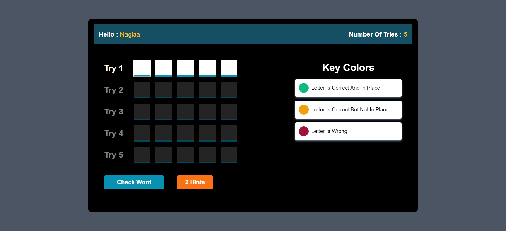

# Word Guessing Game

This is a Word Guessing Game built using HTML, CSS, and JavaScript. The goal of the game is to guess a hidden word within a limited number of tries. With each incorrect guess, the player is allowed to attempt again until they either guess the word correctly or exhaust their tries.

## Features

- Multiple Tries: Players can select the number of attempts (up to 5) they want at the start of 
  the game.

- Hints: Players are provided with 2 hints to help reveal random letters in the word.
- Interactive UI: The game provides instant feedback on letter guesses:

    - Green background for correct letters.
    - Yellow background for letters that are in the word but in the wrong position.
    - Red background for incorrect letters.

- Responsive Design: The game adapts to different screen sizes, making it playable on both desktop
  and mobile devices.

- Customizable: Players can input their name, which is displayed throughout the game.

## Technologies Used
- HTML5: For structuring the webpage.
- JavaScript (ES6): For game logic and interactivity.
- Tailwind CSS

## preview

## Live Demo 
[https://naglaa99.github.io/word-guessing-game/]
